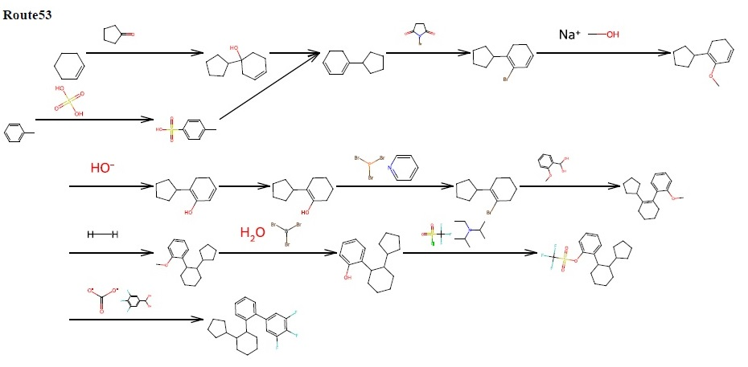

# retrek-ui : user interface for ReTReK
このパッケージはReTReK (逆合成の知識を使用したデータ駆動型コンピュータ支援合成計画ツール)をユーザーフレンドリーに使うためのウェブインタフェースを提供する。分子の化学構造をSMILES記述で指定するのみで、合成反応経路を探索し、pdf ファイルとして取得することが可能である。また、探索結果をデータベースに登録すれば、任意の表示サイズでpptxファイルに変換できる。
    

  

### 動作確認済み環境
- Ubuntu 22.04.3 LTS on Windows Subsystem for Linux version 2.2.4.0

### セットアップ方法 
以下をターミナルで実行する。手順5の、省力化スクリプトを利用することで、作業を簡略化できる。 

#### 手順1: コードを作業用ディレクトリーにダウンロードする。 
cd hoge 
git clone https://github.com/kisapapa1227/retrek-ui.git 
cd retrek-ui 
git clone https://github.com/kisapapa1227/ReTReKpy.git 
cp .env.easy .env # docker の設定ファイルを準備する。 

#### 手順2:Dockerコンテナを作成する。 
sudo su 
docker-compose down 
docker-compose rm -f 
docker volume prune -f 
docker network prune -f 
docker run --rm -u "$(id -u):$(id -g)" -v $(pwd):/var/www/html -w /var/www/html laravelsail/php83-composer:latest composer install --ignore-platform-reqs 

#### https の設定（port:80 の利用状態の確認） 
lsof -i:80　# ポートの利用状態を確認する。 
COMMAND    PID     USER   FD   TYPE DEVICE SIZE/OFF NODE NAME 
apache2 113106     root    4u  IPv6 864638      0t0  TCP *:80 (LISTEN) 
 
上記のように表示された場合、port:80を利用しているサービスを停止する。 
service apache2 stop 

同様に、 
/var/www/html が存在する場合、別名で保存するか、必要がなければ消去する。 
mv /var/www/html /var/www/html.org 
rm -rf /var/www/html 

#### 手順3:Dockerイメージを作成、起動する。 
ln -s $(pwd) /var/www/html 
chmod 666 /var/www/html/.env 
touch /var/www/html/storage/logs/laravel.log 
chmod 666 /var/www/html/storage/logs/laravel.log 
chmod -R 777 /var/www/html 

./vendor/bin/sail up -d 
./vendor/bin/sail artisan key:generate 
./vendor/bin/sail artisan migrate 
./vendor/bin/sail npm install 
./vendor/bin/sail npm run build 

ブラウザから 
http://localhost 
で接続する。 

#### 手順4:Docker イメージを再利用する。 
手順1-3で作成した Docker イメージはコンピュータ再起動後でも利用できる。 
cd /var/www/html/ 
sudo ./vendor/bin/sail up -d  
ただし、apache2 等が起動している場合、停止する。 
sudo service apache2 stop 

#### 手順5:手順の自動化。 
手順1,2,3 は、このページのディレクトリー Installer に準備されているスクリプトファイルを実行することで省力化できる。 
あらかじめ任意のディレクトリー hoge に InstallerStep1.sh、InstallerStep2.sh、InstallerStep3.sh、InstallerStep4.sh をダウンロードする。 
cd hoge 
sh InstallerStep1.sh 
sh InstallerStep2.sh 
sh InstallerStep3.sh 
ただし、https の設定に関しては、必要であれば、InstallerStep3.sh の実行時に指示されるので、上述の手順を参考に、指示に従う。 

#### バージョンアップに関して。 
バージョンアップの場合、同名で旧バージョンのイメージが存在すると、そのイメージが優先的に利用されるので 
sh InstallerStep4.sh 
を実行し、存在するイメージの削除をした後 
sh InstallerStep3.sh 
を実行する。

#### ユーザーマニュアル
<a href="./Installer/retrek-ui-user-manualV1.3.pdf">ユーザーマニュアル</a>に操作を示す。
